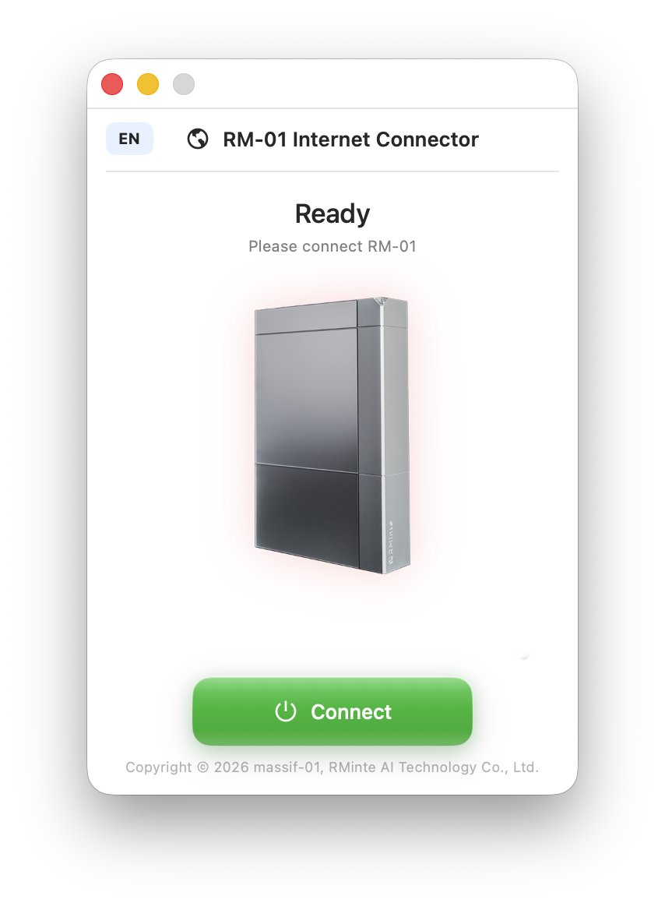
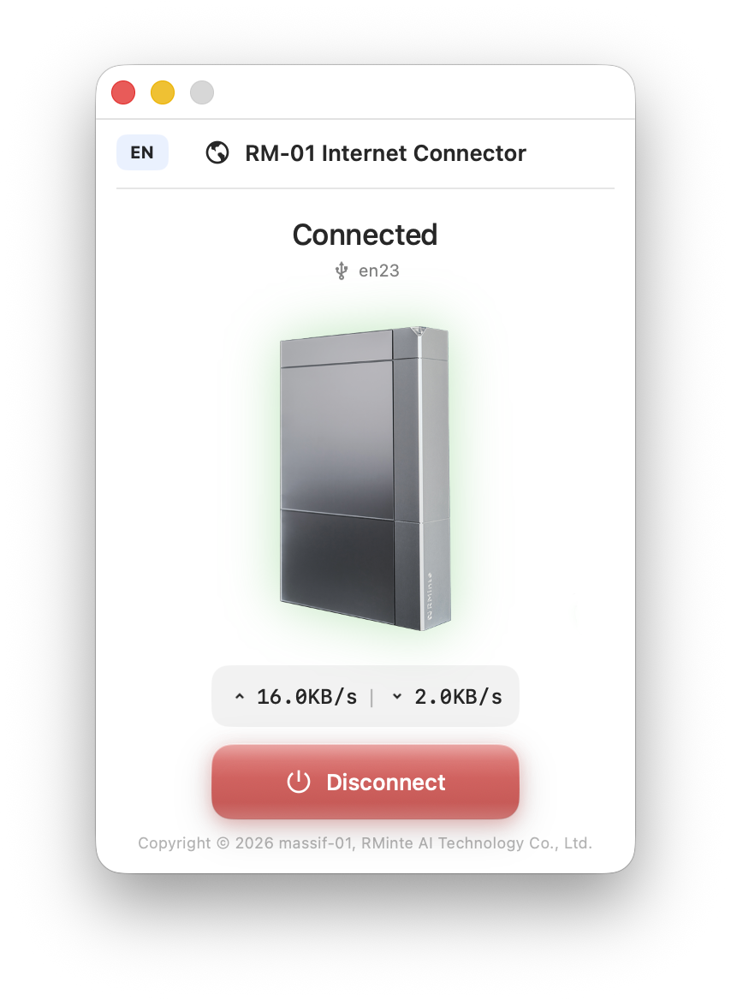
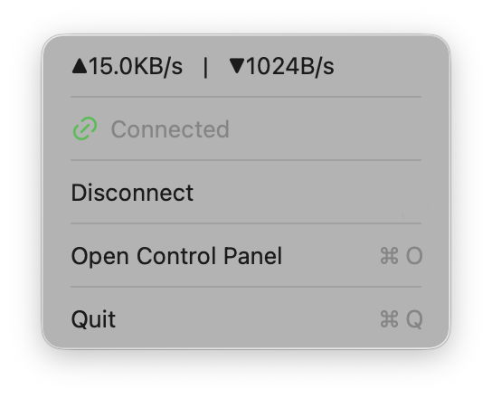

# RM-01 Internet Connector

[English](#english) | [中文](#中文)

---

<a name="english"></a>
## English

### Overview

RM-01 Internet Connector is a cross-platform application that shares your computer's internet connection with RM-01 devices via the AX88179A USB Ethernet adapter.

<p>



</p>

### Supported Platforms

| Platform | GUI | CLI | Status |
|----------|-----|-----|--------|
| macOS | ✅ | ✅ | Stable |
| Windows | ✅ | ✅ | Stable |
| Linux | ✅ | ✅ | Stable |

### Features

- **One-Click Connection** - Share internet with a single click
- **Real-time Speed Monitor** - Live upload/download speed display (GUI)
- **Consistent UI** - Same beautiful design across all platforms
- **Bilingual Support** - Full Chinese and English localization
- **Auto Detection** - Automatically detects AX88179A USB Ethernet adapters
- **CLI Support** (All Platforms) - Command-line control for automation and SSH remote access

### Project Structure

```
RM-01 Internet Connector/
├── mac_version/           # macOS version (Swift/SwiftUI + Python CLI)
│   ├── Sources/           # GUI application
│   ├── cli/               # CLI tool
│   ├── Package.swift
│   └── build.sh
├── win_version/           # Windows version (C#/WPF + Python CLI)
│   ├── RM01InternetConnector.Win/  # GUI application
│   ├── cli/                         # CLI tool
│   └── build.ps1
├── linux_version/         # Linux version (Python/PyQt6)
│   ├── main.py            # GUI entry
│   ├── cli.py             # CLI entry
│   └── build-appimage.sh
├── icons/                 # Shared icon resources
└── README.md
```

### Quick Start

#### macOS

**GUI Mode:**
```bash
cd mac_version
./build.sh
# App will be created in mac_version/dist/
```

**CLI Mode** (for automation and remote control):

*Option 1: Python Script (Developers)*
```bash
cd mac_version/cli
pip3 install -r requirements.txt

# Check connection status
python3 cli.py status

# Detect RM-01 adapter
python3 cli.py detect

# Enable internet sharing (requires sudo)
sudo python3 cli.py connect

# Disable internet sharing
sudo python3 cli.py disconnect

# Language support
python3 cli.py --lang zh status    # Chinese
python3 cli.py --lang en status    # English
```

*Option 2: Standalone Executable (End Users)*
```bash
# Build the executable
cd mac_version/cli
./build_executable.sh

# Use the executable (requires sudo)
sudo ./dist/rm01-cli status
sudo ./dist/rm01-cli connect
sudo ./dist/rm01-cli disconnect

# Language support
./dist/rm01-cli --lang zh status
```

**Install Globally** (optional):
```bash
# Copy to /usr/local/bin for global access
sudo cp mac_version/cli/dist/rm01-cli /usr/local/bin/

# Now you can use from anywhere
rm01-cli status
sudo rm01-cli connect
```

**Note**: All network configuration commands require sudo privileges.

#### Windows

**GUI Mode:**
```powershell
cd win_version
.\build.ps1
# App will be created in win_version\publish\
```

**CLI Mode** (for automation and remote control):

*Option 1: Python Script (Developers)*
```cmd
cd win_version\cli
pip install -r requirements.txt

# Check connection status
python cli.py status

# Detect RM-01 adapter
python cli.py detect

# Enable internet sharing (requires Administrator)
python cli.py connect

# Disable internet sharing
python cli.py disconnect

# Language support
python cli.py --lang zh status    # Chinese
python cli.py --lang en status    # English
```

*Option 2: Standalone Executable (End Users)*
```cmd
# Build the executable
cd win_version\cli
build_exe.bat

# Use the executable (requires Administrator)
dist\rm01-cli.exe status
dist\rm01-cli.exe connect
dist\rm01-cli.exe disconnect

# Language support
dist\rm01-cli.exe --lang zh status
```

**Add to PATH** (optional):
```cmd
# Copy to system directory for global access
copy win_version\cli\dist\rm01-cli.exe C:\Windows\System32\

# Now you can use from anywhere
rm01-cli.exe status
rm01-cli.exe connect
```

**Note**: All network configuration commands require Administrator privileges. Right-click Command Prompt → "Run as Administrator"

#### Linux

**GUI Mode:**
```bash
cd linux_version
python3 main.py
```

**CLI Mode** (for SSH remote control):
```bash
cd linux_version

# Check connection status
python3 cli.py status

# Connect RM-01 to internet
python3 cli.py connect

# Disconnect
python3 cli.py disconnect

# Detect RM-01 adapter
python3 cli.py detect

# Language support
python3 cli.py --lang zh status    # Chinese
python3 cli.py --lang en status    # English
```

**Global CLI Command** (optional):
```bash
cd linux_version
sudo ln -s "$(pwd)/cli.py" /usr/local/bin/rm01-cli
sudo chmod +x /usr/local/bin/rm01-cli

# Now you can use from anywhere
rm01-cli status
rm01-cli connect
rm01-cli disconnect
```

**Build AppImage:**
```bash
./build-appimage.sh
```

### How It Works

RM-01 contains an AX88179A switch chip that:
1. Assigns IP `10.10.99.100` to the connected computer via DHCP
2. Expects the computer to act as its gateway

This application:
1. Detects the AX88179A USB adapter
2. Configures static IP (10.10.99.100) for stability
3. Enables IP forwarding
4. Sets up NAT to share internet with RM-01

### System Requirements

- **macOS**: 13.0 (Ventura) or later
- **Windows**: 10/11 with .NET 8.0
- **Linux**: Ubuntu 20.04+ / Debian 11+ / Fedora 35+ or equivalent

### License

Apache License 2.0

Copyright © 2026 massif-01, RMinte AI Technology Co., Ltd.

---

<a name="中文"></a>
## 中文

### 概述

RM-01 互联网连接助手是一款跨平台应用，通过 AX88179A USB 网卡将电脑的互联网连接共享给 RM-01 设备。

<p>


</p>

### 支持平台

| 平台 | 图形界面 | 命令行 | 状态 |
|------|---------|--------|------|
| macOS | ✅ | ✅ | 稳定 |
| Windows | ✅ | ✅ | 稳定 |
| Linux | ✅ | ✅ | 稳定 |

### 功能特点

- **一键连接** - 单击即可共享网络
- **实时网速监控** - 实时显示上传/下载速度（图形界面）
- **统一界面** - 所有平台保持一致的精美设计
- **双语支持** - 完整的中英文本地化
- **自动检测** - 自动检测 AX88179A USB 网卡
- **命令行支持** (全平台) - 支持自动化和 SSH 远程控制

### 项目结构

```
RM-01 Internet Connector/
├── mac_version/           # macOS 版本 (Swift/SwiftUI + Python CLI)
│   ├── Sources/           # 图形界面应用
│   ├── cli/               # 命令行工具
│   ├── Package.swift
│   └── build.sh
├── win_version/           # Windows 版本 (C#/WPF + Python CLI)
│   ├── RM01InternetConnector.Win/  # 图形界面应用
│   ├── cli/                         # 命令行工具
│   └── build.ps1
├── linux_version/         # Linux 版本 (Python/PyQt6)
│   ├── main.py            # 图形界面入口
│   ├── cli.py             # 命令行入口
│   └── build-appimage.sh
├── icons/                 # 共享图标资源
└── README.md
```

### 快速开始

#### macOS

**图形界面模式：**
```bash
cd mac_version
./build.sh
# 应用将创建在 mac_version/dist/
```

**命令行模式** (适合自动化和远程控制)：

*方式1：Python 脚本（开发者）*
```bash
cd mac_version/cli
pip3 install -r requirements.txt

# 查看连接状态
python3 cli.py status

# 检测 RM-01 适配器
python3 cli.py detect

# 启用网络共享（需要 sudo）
sudo python3 cli.py connect

# 禁用网络共享
sudo python3 cli.py disconnect

# 语言支持
python3 cli.py --lang zh status    # 中文
python3 cli.py --lang en status    # 英文
```

*方式2：独立可执行文件（最终用户）*
```bash
# 构建可执行文件
cd mac_version/cli
./build_executable.sh

# 使用可执行文件（需要 sudo）
sudo ./dist/rm01-cli status
sudo ./dist/rm01-cli connect
sudo ./dist/rm01-cli disconnect

# 语言支持
./dist/rm01-cli --lang zh status
```

**全局安装**（可选）：
```bash
# 复制到 /usr/local/bin 以便全局访问
sudo cp mac_version/cli/dist/rm01-cli /usr/local/bin/

# 现在可以在任何地方使用
rm01-cli status
sudo rm01-cli connect
```

**注意**：所有网络配置命令需要 sudo 权限。

#### Windows

**图形界面模式：**
```powershell
cd win_version
.\build.ps1
# 应用将创建在 win_version\publish\
```

**命令行模式** (适合自动化和远程控制)：

*方式1：Python 脚本（开发者）*
```cmd
cd win_version\cli
pip install -r requirements.txt

# 查看连接状态
python cli.py status

# 检测 RM-01 适配器
python cli.py detect

# 启用网络共享（需要管理员权限）
python cli.py connect

# 禁用网络共享
python cli.py disconnect

# 语言支持
python cli.py --lang zh status    # 中文
python cli.py --lang en status    # 英文
```

*方式2：独立可执行文件（最终用户）*
```cmd
# 构建可执行文件
cd win_version\cli
build_exe.bat

# 使用可执行文件（需要管理员权限）
dist\rm01-cli.exe status
dist\rm01-cli.exe connect
dist\rm01-cli.exe disconnect

# 语言支持
dist\rm01-cli.exe --lang zh status
```

**添加到系统路径**（可选）：
```cmd
# 复制到系统目录以便全局访问
copy win_version\cli\dist\rm01-cli.exe C:\Windows\System32\

# 现在可以在任何地方使用
rm01-cli.exe status
rm01-cli.exe connect
```

**注意**：所有网络配置命令需要管理员权限。右键点击命令提示符 → "以管理员身份运行"

#### Linux

**图形界面模式：**
```bash
cd linux_version
python3 main.py
```

**命令行模式** (适合 SSH 远程控制)：
```bash
cd linux_version

# 查看连接状态
python3 cli.py status

# 连接 RM-01 到互联网
python3 cli.py connect

# 断开连接
python3 cli.py disconnect

# 检测 RM-01 适配器
python3 cli.py detect

# 语言支持
python3 cli.py --lang zh status    # 中文
python3 cli.py --lang en status    # 英文
```

**全局命令安装**（可选）：
```bash
cd linux_version
sudo ln -s "$(pwd)/cli.py" /usr/local/bin/rm01-cli
sudo chmod +x /usr/local/bin/rm01-cli

# 现在可以在任何地方使用
rm01-cli status
rm01-cli connect
rm01-cli disconnect
```

**构建 AppImage：**
```bash
./build-appimage.sh
```

### 工作原理

RM-01 内置 AX88179A 交换机芯片：
1. 通过 DHCP 给连接的电脑分配 IP `10.10.99.100`
2. 期望电脑作为其网关

本应用程序：
1. 检测 AX88179A USB 网卡
2. 配置静态 IP (10.10.99.100) 以确保稳定性
3. 启用 IP 转发
4. 设置 NAT 将网络共享给 RM-01

### 系统要求

- **macOS**: 13.0 (Ventura) 或更高版本
- **Windows**: 10/11，需要 .NET 8.0
- **Linux**: Ubuntu 20.04+ / Debian 11+ / Fedora 35+ 或同等版本

### 许可证

Apache License 2.0

Copyright © 2026 massif-01, RMinte AI Technology Co., Ltd.

---

## Credits

Made for RM-01 users

Built with Swift, C#, and Python
